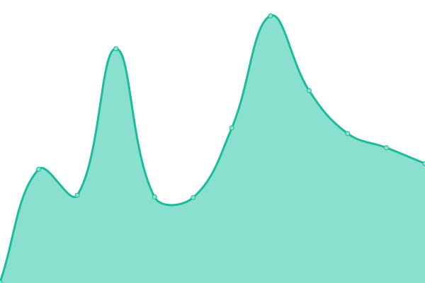

# [📈 Live Status](https://complexdatacollective.github.io/service-status): <!--live status--> **🟩 All systems operational**

This repository contains the open-source uptime monitor and status page for [Complex Data Collective](https://complexdatacollective.org), powered by [Upptime](https://github.com/upptime/upptime).

With [Upptime](https://upptime.js.org), you can get your own unlimited and free uptime monitor and status page, powered entirely by a GitHub repository. We use [Issues](https://github.com/complexdatacollective/service-status/issues) as incident reports, [Actions](https://github.com/complexdatacollective/service-status/actions) as uptime monitors, and [Pages](https://complexdatacollective.github.io/service-status) for the status page.

<!--start: status pages-->
<!-- This summary is generated by Upptime (https://github.com/upptime/upptime) -->
<!-- Do not edit this manually, your changes will be overwritten -->
<!-- prettier-ignore -->
| URL | Status | History | Response Time | Uptime |
| --- | ------ | ------- | ------------- | ------ |
|  [Project homepage](https://networkcanvas.com) | 🟩 Up | [project-homepage.yml](https://github.com/complexdatacollective/service-status/commits/HEAD/history/project-homepage.yml) | 

 249ms
     
 | 

<a href="https://status.networkcanvas.com/history/project-homepage">100.00%</a>
    

|  [Documentation site](https://documentation.networkcanvas.com) | 🟩 Up | [documentation-site.yml](https://github.com/complexdatacollective/service-status/commits/HEAD/history/documentation-site.yml) | 

 419ms
     
 | 

<a href="https://status.networkcanvas.com/history/documentation-site">100.00%</a>
    

|  [User community](https://community.networkcanvas.com) | 🟩 Up | [user-community.yml](https://github.com/complexdatacollective/service-status/commits/HEAD/history/user-community.yml) | 

 281ms
     
 | 

<a href="https://status.networkcanvas.com/history/user-community">100.00%</a>
    

|  [Partner services](https://partnerservices.networkcanvas.com) | 🟩 Up | [partner-services.yml](https://github.com/complexdatacollective/service-status/commits/HEAD/history/partner-services.yml) | 

 238ms
     
 | 

<a href="https://status.networkcanvas.com/history/partner-services">100.00%</a>
    

|  [Fresco Sandbox](https://fresco-sandbox.networkcanvas.com) | 🟩 Up | [fresco-sandbox.yml](https://github.com/complexdatacollective/service-status/commits/HEAD/history/fresco-sandbox.yml) | 

 253ms
     
 | 

<a href="https://status.networkcanvas.com/history/fresco-sandbox">100.00%</a>
    

|  [Complex Data Collective website](https://complexdatacollective.org) | 🟩 Up | [complex-data-collective-website.yml](https://github.com/complexdatacollective/service-status/commits/HEAD/history/complex-data-collective-website.yml) | 

 218ms
     
 | 

<a href="https://status.networkcanvas.com/history/complex-data-collective-website">100.00%</a>
    

<!--end: status pages-->

[**Visit our status website →**](https://complexdatacollective.github.io/service-status)

## 📄 License

- Powered by: [Upptime](https://github.com/upptime/upptime)
- Code: [MIT](./LICENSE) © [Complex Data Collective](https://complexdatacollective.org)
- Data in the `./history` directory: [Open Database License](https://opendatacommons.org/licenses/odbl/1-0/)
